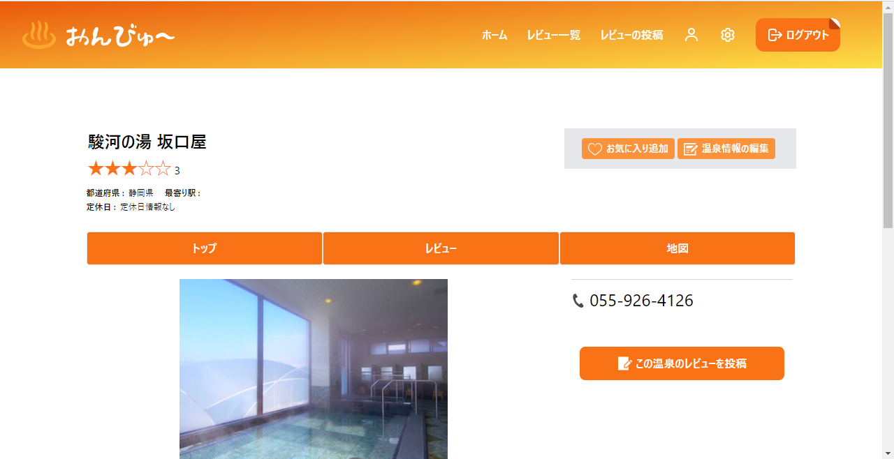

# 要件定義

## サービス概要

温泉のレビューをつけたり、投稿されたレビューを閲覧できる会員制レビューアプリ

## どういう思いで作ったか？

私の趣味の一つは、温泉やサウナに行くことです。私は肩こりによる頭痛が多く、温泉は生活において欠かせない存在になっています。
そこで重要になってくるのが、いかにして良い温泉施設を選ぶかです。温泉に行く際には時間もお金も投資するため、私はレビューサイトを確認し、良い評価の温泉施設を選びたいと思っています。

レビューサイトは、多くの人たちの意見が集まり、私たちの選択を助けてくれます。
しかし、こと温泉に関しては、有名なレビューサイトがあまり存在していません。最近では、サウナブームが起こり、温泉施設への来客数も増えています。このような状況から、温泉のレビューサイトへの需要は今後高まると考えました。

一方で、Googleマップやアマゾンのレビューには、サクラによる書き込みが問題視されており、信頼性が低下しています。インターネットの膨大な情報が逆に信頼性を損なっているため、信憑性のあるレビューサイトが求められる時代になっています。

そこで、私が欲しいと思っていた機能と世間のニーズに応えるため、信頼性の高い温泉レビューサイトを制作することに決めました。
温泉が好きな人たちが、安心して素晴らしい温泉施設を見つけられるサービスを提供したいという思いが、このWebサイトを製作する経緯となります。

## サービスに使った技術

・PHP -v8.2.2
・Node.js -v18.12.1
・npm -v9.42
・Laravel -v10.4.1
・Tailwind CSS -v3.2.4
・Github
・heroku
・AWS S3
・apache -v2.4.55
・composer -v2.5.2
・nginx -v1.22.1
・carbon
・GooglemapsAPI（Geocoding API、Maps JavaScript API）

## 仕様

・認証機能

・レビュー投稿機能

・投稿したレビュー、温泉を閲覧可能

・レビュー一覧・詳細表示機能

・ユーザーが気に入った温泉をお気に入り追加できる機能

・画像ファイルのアップロード機能

・DBテーブルのリレーション管理機能

・GooglemapのAPI連携による、レビューした温泉の位置情報、定休日、最寄り駅を取得しDBに格納、表示させる機能

## スクリーンショット

